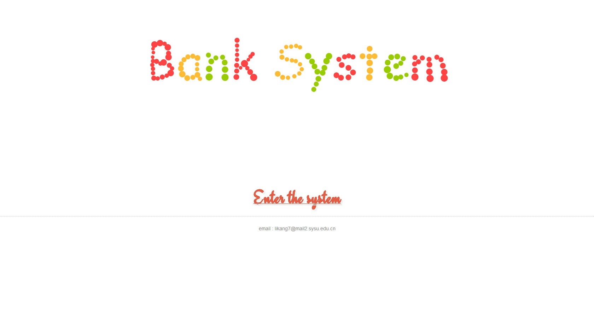

bankSystem
==========

A java/jsp/servlet version simplified bank managent system. Just a toy for practicing.  
This is a good project to get start with jsp/servlet coding with 3-tile architecture.  
Moreover, you can apply OOP and design patterns you learned as well.  
At last, you can learn how to use DAO(Data Access Objects) pattern to access MySQL.

Dependency Information
======================

Tomcat v7.0
MySQL 5.1+
JDK 1.6 +

Installation
============
Start the tomcat server at localhost and visit it through: <http://localhost:8080/bankSystem/index.html>.

Screenshot
==========

